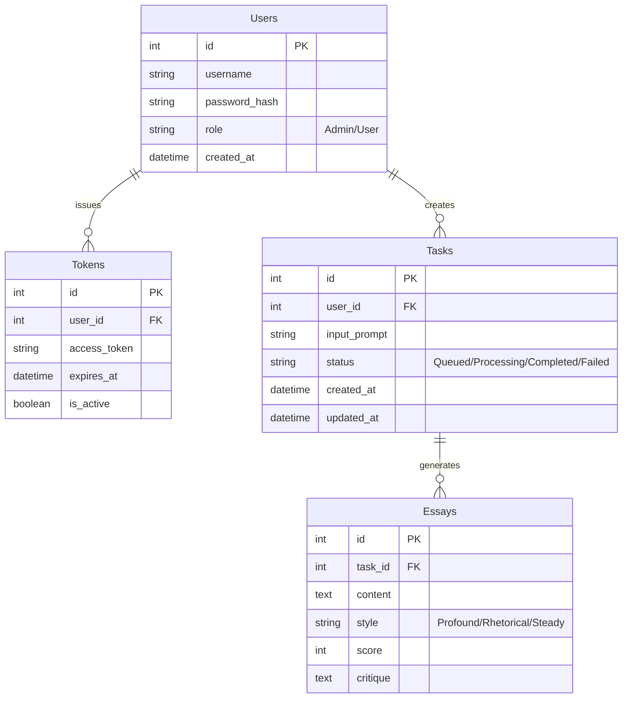

# 概要设计文档 (HLD) - 笔阵 (BiZhen)

**版本**: 1.0  
**日期**: 2026-01-30  
**密级**: 内部绝密 (Private & Confidential)

---

## 1. 系统架构设计 (System Architecture)

### 1.1 架构模式
本系统采用 **前后端分离** 架构，结合 **Micro-Agent** 编排模式。
- **前端 (Frontend)**: 基于 React/Vue 的单页应用 (SPA)，负责与用户交互及实时展示 Agent 思考过程。
- **API 网关/后端 (Backend API)**: 基于 FastAPI (Python) 构建的 RESTful 服务，处理认证、任务调度及数据持久化。
- **Agent 编排层 (Agent Orchestration)**: 核心业务逻辑层，使用 LangGraph 管理 5 个 Agent 的状态流转与协作。
- **数据层 (Data Layer)**: 包含关系型数据库 (PostgreSQL) 用于业务数据，向量数据库 (Chroma/Milvus) 用于 RAG 检索。
- **外部服务 (External Services)**: 集成 DeepSeek API 等国内合规大模型服务。

### 1.2 架构图
```mermaid
graph TD
    UserClient[用户客户端 (Browser/React)] -->|HTTPS/WSS| APIGateway[API 网关 (Nginx/Traefik)]
    APIGateway -->|REST API| Backend[后端服务 (FastAPI)]
    
    subgraph "后端核心服务 (Backend Core)"
        Backend --> AuthService[认证模块 (Auth Service)]
        Backend --> TaskManager[任务管理模块 (Task Manager)]
        TaskManager -->|Push Task| RedisBroker[(Redis Message Broker)]
        RedisBroker -->|Pull Task| Worker[异步 Worker (Celery/Arq)]
        
        Worker --> Orchestrator[Agent 编排器 (LangGraph)]
    end
    
    subgraph "Agent 编排 (Agent Orchestration)"
        Orchestrator --> Strategist[策划 Agent]
        Strategist --> Librarian[搜查 Agent]
        Librarian --> Outliner[构思 Agent]
        
        Outliner -->|Fan-out| WriterA[撰稿 Agent (深刻)]
        Outliner -->|Fan-out| WriterB[撰稿 Agent (文采)]
        Outliner -->|Fan-out| WriterC[撰稿 Agent (稳健)]
        
        WriterA --> GraderA[阅卷 Agent]
        WriterB --> GraderB[阅卷 Agent]
        WriterC --> GraderC[阅卷 Agent]
        
        GraderA --> Aggregator[结果聚合器]
        GraderB --> Aggregator
        GraderC --> Aggregator
    end
    
    subgraph "数据存储 (Data Persistence)"
        AuthService --> RDB[(关系型数据库 PG/MySQL)]
        Aggregator --> RDB
        AgentLib --> VectorDB[(向量数据库 Chroma/Milvus)]
        Worker -.-> Redis[(Redis Cache/Queue)]
    end
    
    subgraph "外部模型服务 (Model Providers)"
        DeepSeekR1[DeepSeek R1 (Reasoner)]
        DeepSeekV3[DeepSeek V3 (Chat)]

        Strategist -.->|API Call| DeepSeekR1
        Librarian -.->|API Call| DeepSeekV3
        Outliner -.->|API Call| DeepSeekR1
        
        WriterA -.->|API Call| DeepSeekR1
        WriterB -.->|API Call| DeepSeekV3
        WriterC -.->|API Call| DeepSeekV3
        
        GraderA -.->|API Call| DeepSeekR1
        GraderB -.->|API Call| DeepSeekR1
        GraderC -.->|API Call| DeepSeekR1
    end
```

---

## 2. 核心模块设计 (Core Module Design)

### 2.1 Agent 编排 (Agent Orchestration)
使用 **LangGraph** 实现复杂的 Fan-out/Fan-in 流程，支持多风格并行生成。

#### 状态模式 (State Schema)
各 Agent 共享一个全局状态对象 `EssayState`：
```python
class EssayState(TypedDict):
    topic: str                  # 原始题目
    angle: str                  # 策划选定的切入角度
    materials: List[str]        # 搜查到的名言/素材
    outline: Dict               # 结构大纲
    # 下述字段用于并行分支
    drafts: Dict[str, str]      # {"profound": "...", "rhetorical": "...", "steady": "..."}
    scores: Dict[str, int]      # {"profound": 52, ...}
    critiques: Dict[str, str]   # {"profound": "评语...", ...}
```

#### 并行工作流逻辑 (Fan-out/Fan-in)
1.  **Strategist (串行 - R1)**: 分析题目，确定立意 (Angle) 并制定针对三种风格的差异化指导策略。使用 **DeepSeek R1** 进行深度推理。
2.  **Librarian (串行 - V3)**: 根据立意检索通用及特定风格所需的素材。使用 **DeepSeek V3** 处理工具调用。
3.  **Outliner (串行 - R1)**: 生成一份通用骨架或包含风格变体的详细大纲。使用 **DeepSeek R1** 确保逻辑严密。
4.  **Writer (并行 Fan-out)**: 
    - 系统派发三个并行的 Writer 任务：
        - `WriterProfound` (使用 **R1**): 侧重哲学思辨。
        - `WriterRhetorical` (使用 **V3**): 侧重辞藻华丽。
        - `WriterSteady` (使用 **V3**): 侧重结构工整。
    - **Strategist** 将风格参数 (`style_param`) 注入各 Writer 的 Prompt 中。
    - 各 Writer 独立生成 `draft`。
5.  **Grader (并行 - R1)**: 
    - 针对每个 Writer 的输出进行独立评分，使用 **DeepSeek R1** 确保评分公允且逻辑深刻。
    - 若某分支分数不达标，仅该分支触发重写循环 (Loop)。
6.  **Aggregator (Fan-in)**: 等待所有分支完成，聚合结果并存入数据库。

### 2.2 异步任务队列 (Task Queue Design)
为保证高并发下的系统稳定性，采用 **Producer-Consumer** 模型处理耗时较长的 LLM 生成任务。

- **组件选型**: Redis (Broker & Backend) + Celery (或 Arq)。
- **流程**:
    1.  **提交 (Producer)**: 
        - API 接收用户请求，生成 `task_id`。
        - 将任务负载 (Payload) 推送至 Redis List/Stream。
        - 立即返回 `task_id` 给用户，状态为 `Queued`。
    2.  **消费 (Consumer)**:
        - 后台 Worker 进程池监听 Redis 队列。
        - 抢占任务并启动 LangGraph 工作流。
        - 实时更新任务状态至 Redis (用于进度查询) 和 PostgreSQL (最终持久化)。
    3.  **结果处理**:
        - 任务完成后，Worker 将最终结果写入 DB，可以设置 TTL 在 Redis 中缓存结果以加速查询。

### 2.3 Prompt 管理 (Prompt Management)
摒弃硬编码 Prompt 的方式，建立专门的 Prompt 管理策略以支持快速迭代和版本控制。

- **存储策略**:
    - **文件系统 (Dev Phase)**: 使用 YAML/JSON 文件存储在代码仓库的 `prompts/` 目录下，按 Agent 分类 (e.g., `prompts/strategist/v1.yaml`)。
    - **数据库/配置中心 (Prod Phase)**: 将 Prompt 模板存入数据库表 `prompt_templates`，包含字段 `version`, `content`, `variables`, `is_active`。
- **动态加载**:
    - 系统启动时加载活跃版本的 Prompt 模板至内存缓存 (Redis)。
    - 支持运行时热更新 (Hot-reload)，无需重启服务即可调整 Agent 行为。
- **模板示例 (YAML)**:
    ```yaml
    name: writer_agent
    version: 1.2
    description: "Write essay based on outline"
    template: |
      你是一个高考作文写手。请根据以下大纲：{outline}
      结合素材：{materials}
      使用 {style} 的风格进行撰写。
      要求：字数800字以上。
    ```

### 2.4 流式响应 (Streaming Response)
为了解决长文本生成的等待焦虑，系统后端需向前端推送实时“思考日志”。
- **技术**: Server-Sent Events (SSE)。
- **实现**:
    - 在 LangGraph 的每个 Node 执行开始和结束时，通过回调函数 (CallbackHandler) 捕获日志。
    - 格式化日志为 JSON (e.g., `{"agent": "Strategist", "status": "thinking", "message": "正在分析题目切入点..."}`)。
    - 通过 FastAPI 的 `EventSourceResponse` 推送给前端。
    - 结合 Redis Pub/Sub，Worker 将日志 Publish 到 Channel，API Server Subscribe 并推送给客户端。

---

## 3. 数据层设计 (Data Layer Design)

### 3.1 ER 图 (Relational DB)


### 3.2 向量数据 (Vector Data)
存储于 ChromaDB 或 Milvus，主要包含名为 `materials_collection` 的集合。
- **Schema**:
    - `id`: UUID
    - `content`: 文本内容 (名言警句、历史典故、优秀范文片段)
    - `metadata`: `{type: "quote/fact/essay", author: "鲁迅", tags: ["爱国", "青年"]}`
    - `embedding`: 1024/1536 维向量

---

## 4. 接口设计 (API Design)

### 4.1 认证接口
| 方法 | 路径 | 描述 | 请求参数 | 响应示例 |
| :--- | :--- | :--- | :--- | :--- |
| **POST** | `/api/auth/login` | 用户凭证登录 | `{"username": "...", "password": "..."}` | `{"token": "ey...", "expires_in": 3600}` |

### 4.2 任务接口
| 方法 | 路径 | 描述 | 请求参数 | 响应示例 |
| :--- | :--- | :--- | :--- | :--- |
| **POST** | `/api/task/create` | 创建生成任务 | `{"prompt": "...", "image_url": "..."}` | `{"task_id": "1024", "status": "queued"}` |
| **GET** | `/api/task/{id}/stream` | 获取实时流日志 | 无 (SSE连接) | `data: {"step": "searching", "msg": "..."}` |
| **GET** | `/api/task/{id}/result` | 获取最终生成结果 | 无 | `{"essays": [{"title": "...", "content": "..."}]}` |

---

## 5. 安全与部署 (Security & Deployment)

### 5.1 安全机制
- **API Token 校验中间件**:
    - FastAPI 中间件拦截所有 `/api/task` 开头的请求。
    - 验证 Header 中的 `Authorization: Bearer <token>`。
    - 检查 Token 是否存在于 Redis/DB 白名单且未过期。
- **API Key 保护**: DeepSeek API Key 仅注入在后端 Docker 环境变量中，前端不可见。

### 5.2 容器化部署建议
推荐使用 Docker Compose 进行单机编排部署：

```yaml
version: '3.8'
services:
  frontend:
    image: bizhen-frontend:latest
    ports:
      - "80:80"
    depends_on:
      - backend

  backend:
    image: bizhen-backend:latest
    environment:
      - DEEPSEEK_API_KEY=${DEEPSEEK_API_KEY}
      - DB_URL=postgresql://user:pass@db:5432/bizhen
      - VECTOR_DB_HOST=chroma
    ports:
      - "8000:8000"
    depends_on:
      - db
      - chroma

  db:
    image: postgres:15
    volumes:
      - pg_data:/var/lib/postgresql/data

  chroma:
    image: chromadb/chroma:latest
    ports:
      - "8001:8000"
    volumes:
      - chroma_data:/chroma/chroma

volumes:
  pg_data:
  chroma_data:
```
